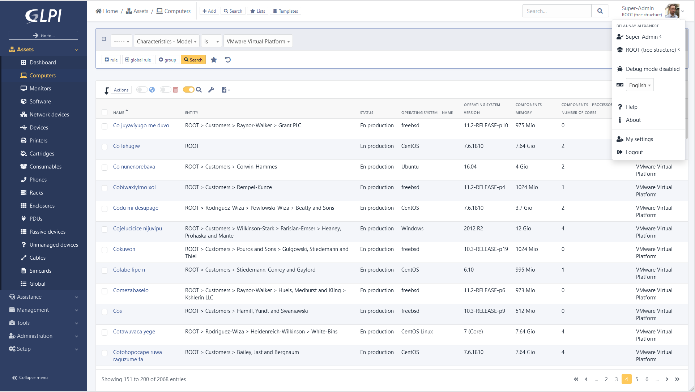

<!--
To README zostało automatycznie wygenerowane przez <https://github.com/YunoHost/apps/tree/master/tools/readme_generator>
Nie powinno być ono edytowane ręcznie.
-->

# GLPI dla YunoHost

[](https://ci-apps.yunohost.org/ci/apps/glpi/)


[](https://install-app.yunohost.org/?app=glpi)

*[Przeczytaj plik README w innym języku.](./ALL_README.md)*

> *Ta aplikacja pozwala na szybką i prostą instalację GLPI na serwerze YunoHost.*  
> *Jeżeli nie masz YunoHost zapoznaj się z [poradnikiem](https://yunohost.org/install) instalacji.*

## Przegląd

GLPI stands for Gestionnaire Libre de Parc Informatique is a Free Asset and IT Management Software package, that provides ITIL Service Desk features, licenses tracking and software auditing.

### Features:

- Inventory of computers, peripherals, network printers and any associated components through an interface, with inventory tools such as: FusionInventory or OCS Inventory
- Data Center Infrastructure Management (DCIM)
- Item lifecycle management
- Licenses management (ITIL compliant)
- Management of warranty and financial information (purchase order, warranty and extension, damping)
- Management of contracts, contacts, documents related to inventory items
- Incidents, requests, problems and changes management
- Knowledge base and Frequently-Asked Questions (FAQ)
- Asset reservation


**Dostarczona wersja:** 10.0.18~ynh1

## Zrzuty ekranu



## Dokumentacja i zasoby

- Oficjalna strona aplikacji: <https://glpi-project.org>
- Oficjalna dokumentacja dla administratora: <https://glpi-install.readthedocs.io/en/latest/>
- Repozytorium z kodem źródłowym: <https://github.com/glpi-project/glpi>
- Sklep YunoHost: <https://apps.yunohost.org/app/glpi>
- Zgłaszanie błędów: <https://github.com/YunoHost-Apps/glpi_ynh/issues>

## Informacje od twórców

Wyślij swój pull request do [gałęzi `testing`](https://github.com/YunoHost-Apps/glpi_ynh/tree/testing).

Aby wypróbować gałąź `testing` postępuj zgodnie z instrukcjami:

```bash
sudo yunohost app install https://github.com/YunoHost-Apps/glpi_ynh/tree/testing --debug
lub
sudo yunohost app upgrade glpi -u https://github.com/YunoHost-Apps/glpi_ynh/tree/testing --debug
```

**Więcej informacji o tworzeniu paczek aplikacji:** <https://yunohost.org/packaging_apps>
